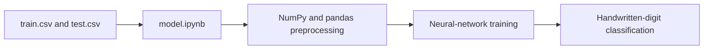

# Neural Network From Scratch

A small notebook-based neural-network project that uses NumPy and pandas to classify handwritten digits.

  

## Overview

The repository contains a single model notebook and CSV data files:

- `model.ipynb` — model development and experiments.
- `train.csv` — training data.
- `test.csv` — test data.

## Preview

## Usage

Open `model.ipynb` in Jupyter and run the notebook cells with `train.csv` and `test.csv` available in the repository root.

The notebook and its datasets are the primary project links; no browser demo is provided.

## Status

This repository is a compact notebook project. No automated test suite or environment specification is included.

> [!TIP]
> Keep `train.csv` and `test.csv` beside `model.ipynb` when opening the notebook; the documented workflow expects repository-root data paths.

## Workflow

